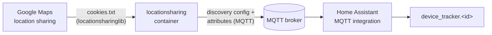

# locationsharing

[](LICENSE)
[](https://hub.docker.com/r/techblog/locationsharing)

A Docker container that reads the locations people share with a Google account through
**Google Maps location sharing** and publishes them to **Home Assistant** as device trackers.
It uses MQTT auto-discovery, so no special configuration is needed on the Home Assistant side:
each person shows up as a `device_tracker` entity with latitude, longitude, GPS accuracy and
battery level.

> **Unofficial project.** It relies on Google's unofficial, undocumented location-sharing
> interface (through the [`locationsharinglib`](https://pypi.org/project/locationsharinglib/)
> library) and authenticates with your browser's Google cookies. Google may change or block that
> interface at any time, and automated access may conflict with Google's Terms of Service. Use it
> at your own risk. This project is not affiliated with or endorsed by Google.

## Table of contents

- [Features](#features)
- [How it works](#how-it-works)
- [Requirements](#requirements)
- [Getting the cookies file](#getting-the-cookies-file)
- [Installation](#installation)
- [Configuration](#configuration)
- [MQTT topics and entities](#mqtt-topics-and-entities)
- [Home Assistant integration](#home-assistant-integration)
- [Troubleshooting](#troubleshooting)
- [Security and privacy](#security-and-privacy)
- [Development](#development)
- [Contributing](#contributing)
- [License](#license)

## Features

- Reads every person who shares their location with the configured Google account, plus the
  account's own location when Google returns it.
- Publishes each person to Home Assistant as an MQTT `device_tracker` using MQTT discovery.
- Sends latitude, longitude, GPS accuracy and battery level as tracker attributes.
- Configurable polling interval (in minutes).
- Turns Google nicknames into MQTT-safe IDs, including transliteration of Hebrew names to Latin
  letters.
- Multi-arch images on Docker Hub: `linux/amd64`, `linux/arm64` and `linux/arm/v7`.

## How it works



The container runs a single Python process (`app/app.py`) with two scheduled jobs:

1. **Location update**, every `UPDATE_INTERVAL` minutes: fetches all people from Google Maps
   location sharing, then publishes an MQTT discovery config and an attributes message for each
   person.
2. **Cookie check**, every 30 minutes (`app/cookieshandler.py`): reads the cookies file and
   requests `https://maps.google.com` with those cookies. The response is thrown away and the
   cookies file is **not** rewritten. The job always logs `Cookies reloaded`, but that doesn't
   mean anything was renewed: it does not extend or renew your cookies.

At startup the container connects to the MQTT broker and `locationsharinglib` validates the
cookies against Google. Both jobs run on a schedule, so the first location update is published
**after** the first `UPDATE_INTERVAL` has passed, not immediately.

## Requirements

- Docker (and optionally Docker Compose).
- A Google account that other people share their location with in Google Maps.
- A `cookies.txt` file for that Google account (see below).
- An MQTT broker (for example Mosquitto) that Home Assistant is connected to, with the
  [MQTT integration](https://www.home-assistant.io/integrations/mqtt/) and discovery enabled
  (the default discovery prefix `homeassistant` is used).

## Getting the cookies file

The container authenticates to Google with cookies exported from a browser session, in the
Netscape `cookies.txt` format (tab-separated, one cookie per line, `#` lines ignored).

1. Sign out of your Google account, then sign in again manually.
2. Browse to [google.com/maps](https://www.google.com/maps).
3. Export your `google.com` cookies to a file in `cookies.txt` format, using a browser extension
   you trust that exports cookies **locally**. The "Get cookies.txt" Chrome extension linked in
   earlier versions of this README is no longer available, and neither is the extension linked
   from the [`locationsharinglib` documentation](https://pypi.org/project/locationsharinglib/).
4. Save the file (for example as `cookies.txt`) in the cookies folder you mount into the container
   (`./locationsharing/cookies` in the Compose example below).

Notes:

- Signing out of that Google session invalidates the cookies. Export them again when that
  happens.
- The published `1.5.0` image ships `locationsharinglib` 4.1.8, which doesn't check for specific
  cookies. An image built today would install `locationsharinglib` 5.x, which requires the file to
  contain a `__Secure-1PSID` or `__Secure-3PSID` cookie.
- A dedicated Google account that only receives location shares limits what a leaked cookie
  file exposes.

## Installation

### Docker Compose

This is the Compose file shipped in the repository (`docker-compose.yaml`), quoted exactly:

```yaml
version: "3.6"
services:
  locationsharing:
    image: techblog/locationsharing
    container_name: locationsharing
    restart: always
    environment:
      - EMAIL_ADDRESS= #Google account email
      - COOKIES_FILE_NAME= #Cookies file name (File name without path)
      - MQTT_HOST= #MQTT Host address
      - MQTT_PORT= #MQTT Port ,Default is 1883
      - MQTT_USERNAME= #MQTT Username
      - MQTT_PASSWORD= #MQTT Password
      - UPDATE_INTERVAL=1 #In minutes
    volumes:
      - ./locationsharing/cookies:/app/cookies
```

1. Create the `./locationsharing/cookies` folder and put your cookies file in it.
2. Fill in the environment variables (see [Configuration](#configuration)). Don't leave
   `MQTT_PORT=` or `UPDATE_INTERVAL=` empty: an empty value overrides the image default and the
   container fails at startup. Set a number, or delete the line to use the default.
3. Start the container:

   ```bash
   docker compose up -d
   docker compose logs -f locationsharing
   ```

### Docker

```bash
docker run -d --name locationsharing --restart always \
  -e EMAIL_ADDRESS=you@gmail.com \
  -e COOKIES_FILE_NAME=cookies.txt \
  -e MQTT_HOST=192.168.1.10 \
  -e MQTT_PORT=1883 \
  -e MQTT_USERNAME=mqtt_user \
  -e MQTT_PASSWORD=mqtt_password \
  -e UPDATE_INTERVAL=1 \
  -v "$(pwd)/locationsharing/cookies:/app/cookies" \
  techblog/locationsharing:latest
```

### Published images

| Registry | Image | Tags | Architectures |
|---|---|---|---|
| Docker Hub | [`techblog/locationsharing`](https://hub.docker.com/r/techblog/locationsharing) | `latest`, `1.0.0` … `1.5.0` | `amd64`, `arm64`, `arm/v7` |

`latest` currently points to `1.5.0` (February 2023). The `VERSION` file in the repository says
`1.6.0`, but that version has not been published to Docker Hub. The repository also has a GHCR
workflow (`ghcr.io/t0mer/locationsharing`), but no public GHCR image exists yet. There are no
GitHub releases.

## Configuration

All configuration is done with environment variables. The defaults below come from the
`Dockerfile` and only apply when a variable is **unset**. A variable set to an empty value (such
as `MQTT_PORT=` in the example Compose file) overrides the default; for `MQTT_PORT` and
`UPDATE_INTERVAL` that makes `int(...)` raise a `ValueError` and the container exits at startup.

| Variable | Default | Required | Description |
|---|---|---|---|
| `EMAIL_ADDRESS` | `""` | Yes | Email address of the Google account the cookies belong to. |
| `COOKIES_FILE_NAME` | `""` | Yes | File name (no path) of the cookies file inside `/app/cookies`. |
| `MQTT_HOST` | `""` | Yes | Hostname or IP address of the MQTT broker. |
| `MQTT_PORT` | `1883` | No | MQTT broker port. Must be a number if set. |
| `MQTT_USERNAME` | `""` | No | MQTT username. |
| `MQTT_PASSWORD` | `""` | No | MQTT password. |
| `UPDATE_INTERVAL` | `1` | No | How often to fetch and publish locations, in whole minutes. Must be a number if set. |

| Path in container | Purpose |
|---|---|
| `/app/cookies` | Folder that holds the cookies file. Mount it as a volume. |

Fixed values that can't be configured: the cookie check runs every 30 minutes, the discovery
prefix is `homeassistant`, and the MQTT connection is plain TCP (no TLS).

## MQTT topics and entities

Each person gets an ID derived from their Google nickname:

- Non-word characters (spaces, `.`, `@`, `-`, …) are removed.
- A name that mixes Latin and other letters keeps only the Latin letters.
- A Hebrew-only name is transliterated to Latin letters (for example `דני` becomes `dny`).
- The account's own entry uses its email address, so `john.doe@gmail.com` becomes
  `johndoegmailcom`.

For every person, on every update, the container publishes (QoS 0, not retained):

| Topic | Payload |
|---|---|
| `homeassistant/device_tracker/<id>/config` | Discovery config (see below) |
| `<id>/attributes` | `{"latitude": …, "longitude": …, "gps_accuracy": …, "battery_level": …}` |

Discovery payload:

```json
{
  "state_topic": "<id>/state",
  "name": "<id>",
  "payload_home": "home",
  "payload_not_home": "not_home",
  "json_attributes_topic": "<id>/attributes"
}
```

Nothing is published to `<id>/state`. Home Assistant places the tracker from the `latitude`,
`longitude` and `gps_accuracy` attributes and works out the state (`home`, `not_home` or a zone
name) from your zones.

The MQTT client ID is `python-mqtt-<random number 0–1000>`, picked at every start.

## Home Assistant integration

1. Make sure the MQTT integration is set up and connected to the same broker.
2. Start the container and wait one `UPDATE_INTERVAL`.
3. A `device_tracker.<id>` entity appears for each person, with `latitude`, `longitude`,
   `gps_accuracy` and `battery_level` attributes. Use it in zones, automations, the map card or
   a person entity.

The discovery config has no `unique_id`, so the entities can't be renamed or managed from the
Home Assistant UI. Because the config is sent again on every update, the trackers come back by
themselves after a Home Assistant restart.

## Troubleshooting

- **The container keeps restarting at startup.** Check the logs. Common causes:
  - The cookies fail validation: `locationsharinglib` checks them when the container starts. An
    empty or wrong `COOKIES_FILE_NAME`, a missing file in the mounted folder, or expired cookies
    all stop the container. Export new cookies.
  - The MQTT broker is unreachable or refuses the connection. The connection attempt at startup
    isn't retried, so the process exits.
  - `MQTT_PORT` or `UPDATE_INTERVAL` is blank or not a number (see
    [Configuration](#configuration)).
- **Locations stopped updating.** The Google session behind the cookies was probably signed out
  or expired. The 30-minute cookie check doesn't renew the file, so export new cookies and
  restart the container.
- **No entities in Home Assistant.** The first update is sent only after `UPDATE_INTERVAL`
  minutes. Check that the log shows `Connected to MQTT Broker!` and `Person: <id>` lines, that
  MQTT discovery is enabled in Home Assistant, and that the broker credentials are correct.
- **The container restarts during an update, and some people never appear.** IDs are built
  from the Google nickname as described in [MQTT topics and entities](#mqtt-topics-and-entities).
  For a nickname made only of digits, or in a script the transliteration table doesn't cover
  (for example Cyrillic, Arabic, or Hebrew mixed with digits), the conversion returns nothing.
  The next step then raises a `TypeError`, the update crashes and the container restarts. Anyone
  listed after that person is never published. Change that person's nickname in Google Maps to
  Latin letters.
- **The broker requires TLS.** TLS isn't supported. Use a plain-TCP listener on a trusted
  network.

## Security and privacy

- **Google cookies give full access to the Google account**, not just to location sharing.
  Keep the cookies file private, restrict its file permissions, never commit it, and consider
  a dedicated Google account.
- **MQTT credentials** are passed as environment variables and sent over plain TCP. Use a
  dedicated MQTT user with limited permissions, and keep the broker on a trusted network.
- **Location data is personal data.** Everyone whose location reaches the broker can be
  tracked by any client that can subscribe to `<id>/attributes`. Lock down broker ACLs, and only
  track people who have agreed to it.

## Development

Project layout:

```
app/app.py             # main loop: MQTT connection, scheduling, publishing
app/cookieshandler.py  # 30-minute cookie check
Dockerfile             # Ubuntu base image with Python 3 and the requirements
docker-compose.yaml    # example deployment
requirements.txt       # loguru, schedule, paho-mqtt, locationsharinglib, requests
VERSION                # image version used by the Docker Hub workflow
```

Build the image locally:

```bash
docker build -t locationsharing .
```

> **Known issue:** a fresh `docker build` currently fails, for two reasons:
>
> - The Ubuntu base image refuses a system-wide `pip install` (PEP 668
>   "externally-managed-environment" error at the `pip3 install` step in the `Dockerfile`).
> - `requirements.txt` isn't pinned, so the build installs `paho-mqtt` 2.x, which rejects the
>   `mqtt_client.Client(...)` call in `app/app.py`.
>
> The published `1.5.0` image predates both changes. It ships Python 3.6.9, `paho-mqtt` 1.6.1
> and `locationsharinglib` 4.1.8.

Workflows (both run manually with `workflow_dispatch`):

- `.github/workflows/docker-image.yml` builds for `linux/amd64`, `linux/arm64` and
  `linux/arm/v7`, and pushes `techblog/locationsharing:latest` and
  `techblog/locationsharing:<VERSION>`.
- `.github/workflows/publish-ghcr.yml` builds the same platforms and pushes
  `ghcr.io/t0mer/locationsharing:<tag>` (input, default `latest`) and `:latest`.

## Contributing

Issues and pull requests are welcome. Please keep changes focused, and describe how you tested
them against Home Assistant.

## License

This project is licensed under the [MIT License](LICENSE).
